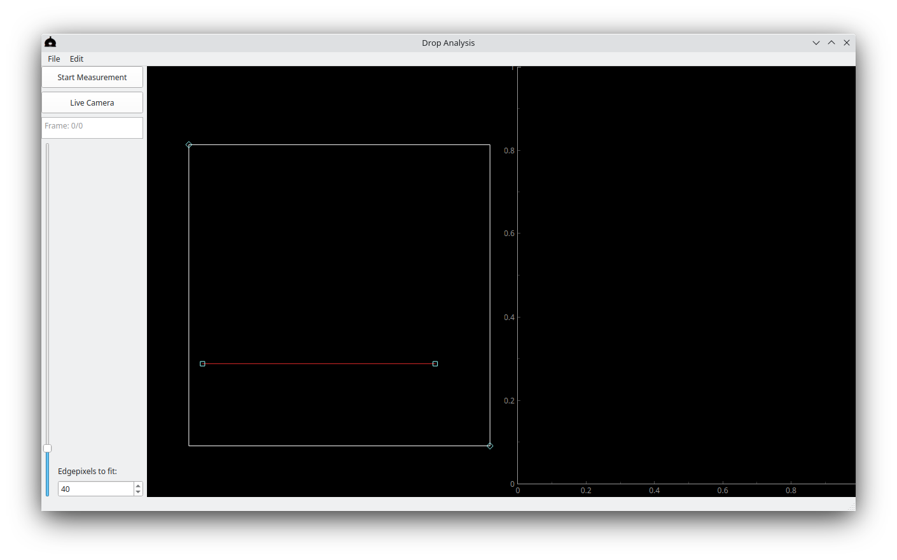
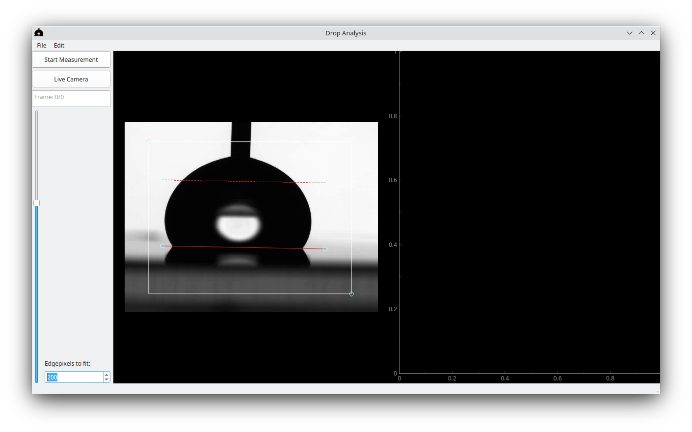
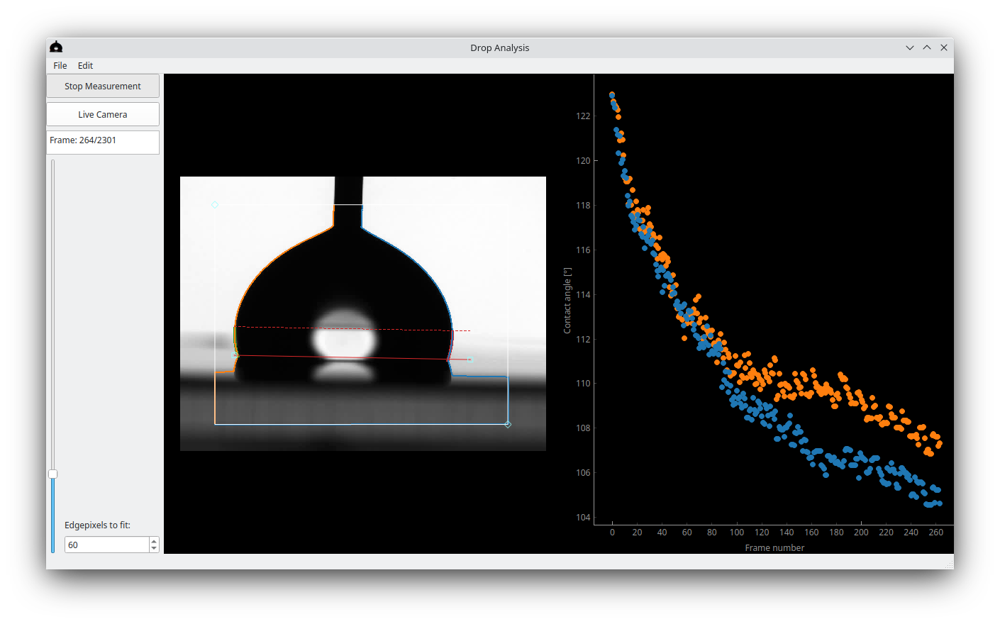
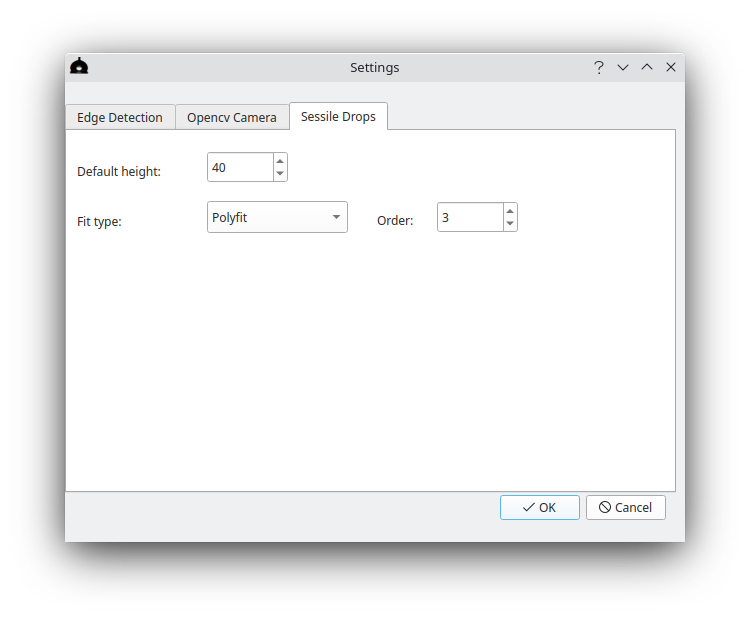
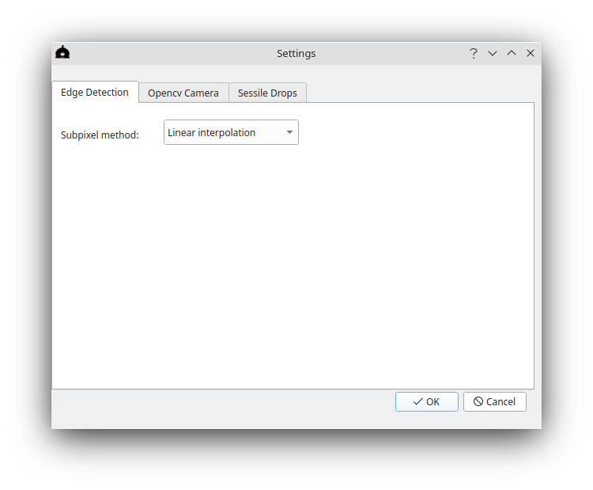
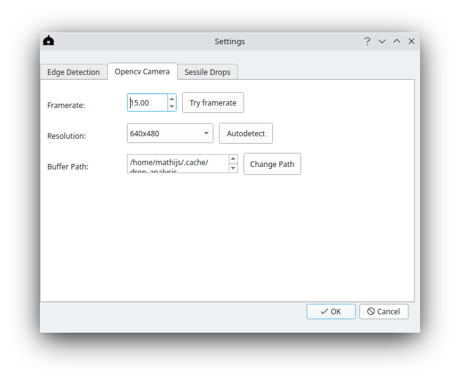

# Getting started

Read the [install instructions](install.md) for installations.

After opening the program you're greeted with a mostly-black screen.

First thing to do is to load the data that is to be analyzed. This can either be a live camera view on supported cameras, see the [Camera settings](#opencv-camera-settings) section  or by looking at saved images, tiffstacks, or video files. The files can be opened by going to file -> open and selecting the file to be analyzed.

## Basic analysis

Once we have access to frames the first frame (or live view) will be displayed in the left view-pane:

### Placing the baseline
First we must put the baseline in the appropriate place. From the baseline the contact angle and contact points will be measured. Click and drag the small red baseline by either of the handles and place it such that it runs along the surface where the drop touches the surface. Scroll the image to zoom in or out to get the perfect position.

### Setting Edgepixels to fit
A dashed red line now appeared above the baseline. This indicates the region of the drop edge that will be used to fit the shape of the drop, and thus the contact angle measurement. The height of this dashed line can be set with the spinbox labled 'Edgepixels to fit'.

### Cropping the image
The red rectangular region sets a crop of the image that is then used for analysis. This can be used to crop out any features that may disturb the fit, and by cropping to a smaller region the analysis will run faster.
The crop can be changed by dragging the whole rectangle, or by dragging one of the anchors (diamond shapes) on the corners of the rectangle.

### Starting the measurement
Once the baseline is set, the appropriate amount of pixels used for the fit is selected, and the image is properly cropped, the analysis can be started by clicking the 'Start Measurement' button. The detected edge will then be shown on the display of the drop (in orange and blue lines), the red and green lines show the fit of this data, and the measured contact angles are shown in the scatter plot on the right. The orange data points show the left contact angle, while the blue data points show the right contact angle.

Note that clicking 'Stop Measurement' pauses the analysis, and it will continue upon clicking 'Start Measurement' again.

Once the analysis is done the contact angles are all plotted on the right and we can look at the graph and/or export the data for further analysis by clicking file -> Save -> Save Data.

The resulting data is a CSV file that contains the left and right contact angle (in degrees) the left and right contact points (in pixels) the drop volume (in pixels$^3$) and the framenumber or the time the frame was taken (if the software has access to that time).

Further analysis of these results are up to the reader, though it is suggested to calibrate the positions and volumes using a calibration measurement that relates the pixels to a length.

## Analysis settings

### Sessile Drops settings
In edit -> settings -> Sessile Drops the fit type of the analysis can be chosen. 

As of v0.3.0 Beta this can either be a polyfit (with a selectable order) or an ellipse fit. A polyfit is the default choice, and can be used in most scenarios. For drops that have a low Bond number (Eötvös number) and are otherwise undisturbed (by for instance, a needle) an ellipse fit may work very well, because it can use the assumption of an ellipse (or circle) shape and as such can reach better fits. 

The default height sets the default value of the 'Edgepixels to fit'. For undisturbed drops a large amount of pixels can increase accuracy, while for drops whose shape away from the contact line is determined by other causes a lower amount of points should be used. For example: drops that interact with objects (needles or wires) or drops that move quickly probably require a smaller amount of points used.

### Edge Detection setting

The Edge Detection tab of the settings allows the user to choose the method that is used for sub-pixel accuracy measurements. The default is linear interpolation. Here we make a linear interpolation between 2 pixels around the edge and define the detected edge as the point where the threshold value as determined by [Otsu's_method](https://en.wikipedia.org/wiki/Otsu%27s_method) is reached.

For more challenging data (for instance with issues around irregular lighting or where utmost precision is needed) the 'Error function fit' can be used. This fits an error function around the edge and defines the detected edge position at the inflection point of the error function. In diffraction limited systems this is expected to work very well, but the compute time required for the full analysis is a lot longer.

### Opencv Camera settings

For v0.3.0 Beta this is only cameras that are supported by openCV.
In edit -> settings -> Opencv Camera you can configure how the software attempts to read out the connected camera. This is expected to work well for a webcam or a camera that has an OS-level driver that allows generic programs to read out frames (eg. directshow drivers on windows).

The framerate sets the framerate the software will attempt to read out the camera. The resolution sets the resolution. Clicking autodetect will run a simple detection algorithm that tries to determine the resolutions that the camera is capable of.

The buffer path is the path where all the frames are stored (uncompressed) while recording and/or analysing. Note that because this stores the frames uncompressed the buffer file can become very large for long measurements!

## Further considerations

### Drop volume
The drop volume is calculated by assuming that the drop is symmetric out-of-plane. Specifically we calculate the volume by calculating a cylinder for each pixel in the z (height) direction between the left and right edge. If the baseline is at an angle this is taken into account.
Note that for the volume calculation the 'Edgepixels to fit' parameter is ignored, and the full edge above the baseline is used to calculate the volume.

### Drops move while measuring
Changing the baseline, edgepixels to fit, and crop while measuring should work fine. All position measurements are taken relative to the origin of the image (0,0 is top-left) and as such moving the crop or baseline will not influence the validity of the result. For large drop motions it is possible that the contact line on the surface changes a bit, and adjustment of the baseline might be needed.

### Trouble placing the baseline
For drops that have contact angles of around 90$^\circ$ finding the exact position where the drop touches the surface can be challenging. An option here is to move forward in time a bit to a point where the surface is clearly visible and using that to determine where the baseline should be placed.
